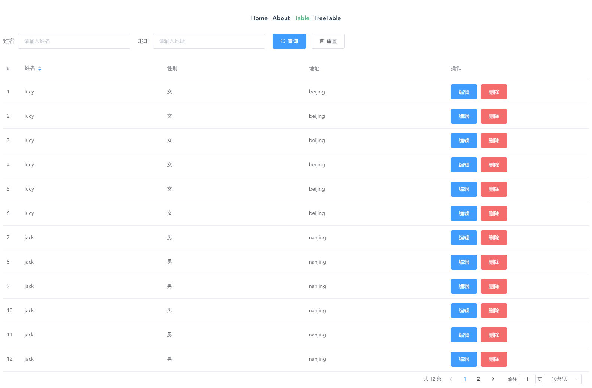

## Table 组件

### Table Attributes
| 参数      | 说明          | 类型      | 可选值                           | 默认值  |
|---------- |-------------- |---------- |--------------------------------  |-------- |
| url | 请求接口 | string | — | — |
| mthdod | 请求方式 | string | get/post | get |
| rowHeader | 渲染表头 | array | — | — |
| show-pagination | 显示分页 | boolean | — | true |
| pagination-layout | 组件布局，子组件名用逗号分隔 | String | `sizes`, `prev`, `pager`, `next`, `jumper`, `->`, `total`, `slot` | 'total,prev,pager,next,jumper,suzes' |
| page-index-key |  | 当前页分页参数 key 值 ｜ string | — | currentPage |
| page-size-key |  | 每页显示条目个数 key 值 ｜ string | — | pageSize |
| page-sizes | 每页显示个数选择器的选项设置 | number[]	 | — | [10, 20, 50, 100] |
| search-columns | 定义渲染搜索的字段 | array	 | — | - |
| result-template | 定义接口返回数据的key值 | object	 | — | { status: 'status', msg: 'msg', data: { name: 'result', children: { data: 'list', total: 'total' } } } |
| show-original-operator | 显示默认的操作按钮（编辑，删除），请绑定相应的事件（on-edit,on-delete） | -	 | — | - |
| height | Table 的高度，默认为自动高度。如果 height 为 number 类型，单位 px；如果 height 为 string 类型，则这个高度会设置为 Table 的 style.height 的值，Table 的高度会受控于外部样式。  | string/number | — | — |
| max-height | Table 的最大高度。合法的值为数字或者单位为 px 的高度。 | string/number | — | — |
| stripe | 是否为斑马纹 table | boolean | — | false |
| border | 是否带有纵向边框 | boolean | — | false |
| size | Table 的尺寸 | string | medium / small / mini | — |
| fit | 列的宽度是否自撑开 | boolean | — | true |
| show-header | 是否显示表头 | boolean | — | true |
| highlight-current-row | 是否要高亮当前行 | boolean | — | false |
| current-row-key | 当前行的 key，只写属性 | String,Number | — | — |
| row-class-name | 行的 className 的回调方法，也可以使用字符串为所有行设置一个固定的 className。 | Function({row, rowIndex})/String | — | — |
| row-style | 行的 style 的回调方法，也可以使用一个固定的 Object 为所有行设置一样的 Style。 | Function({row, rowIndex})/Object | — | — |
| cell-class-name | 单元格的 className 的回调方法，也可以使用字符串为所有单元格设置一个固定的 className。 | Function({row, column, rowIndex, columnIndex})/String | — | — |
| cell-style | 单元格的 style 的回调方法，也可以使用一个固定的 Object 为所有单元格设置一样的 Style。 | Function({row, column, rowIndex, columnIndex})/Object | — | — |
| header-row-class-name | 表头行的 className 的回调方法，也可以使用字符串为所有表头行设置一个固定的 className。 | Function({row, rowIndex})/String | — | — |
| header-row-style | 表头行的 style 的回调方法，也可以使用一个固定的 Object 为所有表头行设置一样的 Style。 | Function({row, rowIndex})/Object | — | — |
| header-cell-class-name | 表头单元格的 className 的回调方法，也可以使用字符串为所有表头单元格设置一个固定的 className。 | Function({row, column, rowIndex, columnIndex})/String | — | — |
| header-cell-style | 表头单元格的 style 的回调方法，也可以使用一个固定的 Object 为所有表头单元格设置一样的 Style。 | Function({row, column, rowIndex, columnIndex})/Object | — | — |
| row-key | 行数据的 Key，用来优化 Table 的渲染；在使用 reserve-selection 功能与显示树形数据时，该属性是必填的。类型为 String 时，支持多层访问：`user.info.id`，但不支持 `user.info[0].id`，此种情况请使用 `Function`。 | Function(row)/String | — | — |
| empty-text | 空数据时显示的文本内容，也可以通过 `slot="empty"` 设置 | String | — | 暂无数据 |
| tooltip-effect | tooltip `effect` 属性 | String | dark/light | | dark |
| show-summary | 是否在表尾显示合计行 | Boolean | — | false |
| sum-text | 合计行第一列的文本 | String | — | 合计 |
| summary-method | 自定义的合计计算方法 | Function({ columns, data }) | — | — |
| span-method | 合并行或列的计算方法 | Function({ row, column, rowIndex, columnIndex }) | — | — |
| select-on-indeterminate | 在多选表格中，当仅有部分行被选中时，点击表头的多选框时的行为。若为 true，则选中所有行；若为 false，则取消选择所有行 | Boolean | — | true |
| indent      | 展示树形数据时，树节点的缩进 | Number | — | 16 |
| lazy        | 是否懒加载子节点数据 | Boolean | — | — |
| load        | 加载子节点数据的函数，lazy 为 true 时生效，函数第二个参数包含了节点的层级信息 | Function(row, treeNode, resolve) | — | — |
| tree-props  | 渲染嵌套数据的配置选项 | Object | — | { hasChildren: 'hasChildren', children: 'children' } |

### Table Events
| 事件名 | 说明 | 参数 |
| ---- | ---- | ---- |
| on-edit | 设置 show-original-operator 为 true 时，编辑按钮的绑定事件 | row， event |
| on-delete | 设置 show-original-operator 为 true 时，删除按钮的绑定事件 | row， event |
| select | 当用户手动勾选数据行的 Checkbox 时触发的事件 | selection, row |
| select-all | 当用户手动勾选全选 Checkbox 时触发的事件 | selection |
| selection-change | 当选择项发生变化时会触发该事件 | selection |
| cell-mouse-enter | 当单元格 hover 进入时会触发该事件 | row, column, cell, event |
| cell-mouse-leave | 当单元格 hover 退出时会触发该事件 | row, column, cell, event |
| cell-click | 当某个单元格被点击时会触发该事件 | row, column, cell, event |
| cell-dblclick | 当某个单元格被双击击时会触发该事件 | row, column, cell, event |
| row-click | 当某一行被点击时会触发该事件 | row, column, event |
| row-contextmenu | 当某一行被鼠标右键点击时会触发该事件 | row, column, event |
| row-dblclick | 当某一行被双击时会触发该事件 | row, column, event |
| header-click | 当某一列的表头被点击时会触发该事件 | column, event |
| header-contextmenu | 当某一列的表头被鼠标右键点击时触发该事件 | column, event |
| sort-change | 当表格的排序条件发生变化的时候会触发该事件 | { column, prop, order } |
| filter-change | 当表格的筛选条件发生变化的时候会触发该事件，参数的值是一个对象，对象的 key 是 column 的 columnKey，对应的 value 为用户选择的筛选条件的数组。 | filters |
| current-change | 当表格的当前行发生变化的时候会触发该事件，如果要高亮当前行，请打开表格的 highlight-current-row 属性 | currentRow, oldCurrentRow |
| header-dragend | 当拖动表头改变了列的宽度的时候会触发该事件 | newWidth, oldWidth, column, event |

### Table Methods
| 方法名 | 说明 | 参数 |
| ---- | ---- | ---- |
| clearSelection | 用于多选表格，清空用户的选择 | — |
| toggleRowSelection | 用于多选表格，切换某一行的选中状态，如果使用了第二个参数，则是设置这一行选中与否（selected 为 true 则选中） | row, selected |
| toggleAllSelection | 用于多选表格，切换所有行的选中状态 | - |
| toggleRowExpansion | 用于可展开表格与树形表格，切换某一行的展开状态，如果使用了第二个参数，则是设置这一行展开与否（expanded 为 true 则展开） | row, expanded |
| setCurrentRow | 用于单选表格，设定某一行为选中行，如果调用时不加参数，则会取消目前高亮行的选中状态。 | row |
| clearSort | 用于清空排序条件，数据会恢复成未排序的状态 | — |
| clearFilter | 不传入参数时用于清空所有过滤条件，数据会恢复成未过滤的状态，也可传入由columnKey组成的数组以清除指定列的过滤条件 | columnKey |
| doLayout | 对 Table 进行重新布局。当 Table 或其祖先元素由隐藏切换为显示时，可能需要调用此方法 | — |
| sort | 手动对 Table 进行排序。参数`prop`属性指定排序列，`order`指定排序顺序。 | prop: string, order: string |


### rowHeader Attributes
| 参数      | 说明          | 类型      | 可选值                           | 默认值  |
|---------- |-------------- |---------- |--------------------------------  |-------- |
| type | 对应列的类型。如果设置了 `selection` 则显示多选框；如果设置了 `index` 则显示该行的索引（从 1 开始计算）；如果设置了 `expand` 则显示为一个可展开的按钮 | string | selection/index/expand | — |
| index | 如果设置了 `type=index`，可以通过传递 `index` 属性来自定义索引 | number, Function(index) | - | - |
| column-key | column 的 key，如果需要使用 filter-change 事件，则需要此属性标识是哪个 column 的筛选条件 | string | — | — |
| label | 显示的标题 | string | — | — |
| prop | 对应列内容的字段名，也可以使用 property 属性 | string | — | — |
| width | 对应列的宽度 | string | — | — |
| min-width | 对应列的最小宽度，与 width 的区别是 width 是固定的，min-width 会把剩余宽度按比例分配给设置了 min-width 的列 | string | — | — |
| fixed | 列是否固定在左侧或者右侧，true 表示固定在左侧 | string, boolean | true, left, right | — |
| render-header | 列标题 Label 区域渲染使用的 Function | Function(h, { column, $index }) | — | — |
| sortable | 对应列是否可以排序，如果设置为 'custom'，则代表用户希望远程排序，需要监听 Table 的 sort-change 事件 | boolean, string | true, false, 'custom' | false |
| sort-method | 对数据进行排序的时候使用的方法，仅当 sortable 设置为 true 的时候有效，需返回一个数字，和 Array.sort 表现一致 | Function(a, b) | — | — |
| sort-by | 指定数据按照哪个属性进行排序，仅当 sortable 设置为 true 且没有设置 sort-method 的时候有效。如果 sort-by 为数组，则先按照第 1 个属性排序，如果第 1 个相等，再按照第 2 个排序，以此类推 | String/Array/Function(row, index) | — | — |
| sort-orders | 数据在排序时所使用排序策略的轮转顺序，仅当 sortable 为 true 时有效。需传入一个数组，随着用户点击表头，该列依次按照数组中元素的顺序进行排序 | array | 数组中的元素需为以下三者之一：`ascending` 表示升序，`descending` 表示降序，`null` 表示还原为原始顺序 | ['ascending', 'descending', null] |
| resizable | 对应列是否可以通过拖动改变宽度（需要在 el-table 上设置 border 属性为真） | boolean | — | true |
| formatter | 用来格式化内容 | Function(row, column, cellValue, index) | — | — |
| show-overflow-tooltip | 当内容过长被隐藏时显示 tooltip | Boolean | — | false |
| align | 对齐方式 | String | left/center/right | left |
| header-align | 表头对齐方式，若不设置该项，则使用表格的对齐方式 | String | left/center/right | — |
| class-name | 列的 className | string | — | — |
| label-class-name | 当前列标题的自定义类名 | string | — | — |
| selectable | 仅对 type=selection 的列有效，类型为 Function，Function 的返回值用来决定这一行的 CheckBox 是否可以勾选 | Function(row, index) | — | — |
| reserve-selection | 仅对 type=selection 的列有效，类型为 Boolean，为 true 则会在数据更新之后保留之前选中的数据（需指定 `row-key`） | Boolean | — | false |
| filters | 数据过滤的选项，数组格式，数组中的元素需要有 text 和 value 属性。 | Array[{ text, value }] | — | — |
| filter-placement | 过滤弹出框的定位 | String | 与 Tooltip 的 `placement` 属性相同 | — |
| filter-multiple | 数据过滤的选项是否多选 | Boolean | — | true |
| filter-method | 数据过滤使用的方法，如果是多选的筛选项，对每一条数据会执行多次，任意一次返回 true 就会显示。 | Function(value, row, column) | — | — |
| filtered-value | 选中的数据过滤项，如果需要自定义表头过滤的渲染方式，可能会需要此属性。 | Array | — | — |

### searchColumns Attribute

| 参数      | 说明          | 类型      | 可选值                           | 默认值  |
|---------- |-------------- |---------- |--------------------------------  |-------- |
| type | 生成搜索项的类型 | string | input/select/date-picker | — |
| text | 生成搜索项展示的文字 | string | — | — |
| prop | 对应列内容的字段名 | string | — | — |


### 使用方式

> 内部发送请求使用了 axios，所以需要安装 axios ，使用的时候需要传入自己封住 axios 实例，response 拦截器返回 response.data, 也可以不指定，
组件内部会默认引入 axios，但是不会对请求拦截个性化定制

```bash
npm install axios // yarn add axios
```

```js
// request.js
import axios from 'axios'

const request = axios.create()

request.interceptors.response.use(res => {
  return JSON.parse(JSON.stringify(res.data))
}, error => {
  return Promise.reject(error.response)
})

export default request
```

1. main.js 中引入

```js
// main.js
import Vue from 'vue'
import Table from './index'
// request 是基于 axios 封装的请求函数
import request from '@/utils/request'
Vue.use(Table, { axios: request })
```

2. 举个🌰

```html
<template>
  <div>
    <Table
      ref="fttable"
      url="/api/table"
      :searchColumns="columns"
      :rowHeader="headers"
    />
  </div>
</template>

<script>

export default {
  name: 'index',
  data () {
    return {
      columns: [
        {
          type: 'input',
          text: '姓名',
          prop: 'name'
        },
        {
          type: 'input',
          text: '地址',
          prop: 'address'
        }
      ],
      headers: [
        {
          label: '#',
          type: 'index'
        },
        {
          label: '姓名',
          prop: 'name',
          sortable: true
        },
        {
          label: '性别',
          prop: 'sex',
          render: (h, params) => {
            return h('div', params.row.sex === 0 ? '男' : '女')
          }
        },
        {
          label: '地址',
          prop: 'address'
        },
        {
          label: '操作',
          render: (h, params) => {
            return (
              <div>
                <el-button type='primary' onClick={() => {
                  console.log(params)
                }}>编辑</el-button>
                <el-button type='danger' onClick={() => {
                  console.log(params)
                  this.$refs.fttable.reload()
                }}>删除</el-button>
              </div>
            )
          }
        }
      ]
    }
  }
}
</script>
```

### 截图


