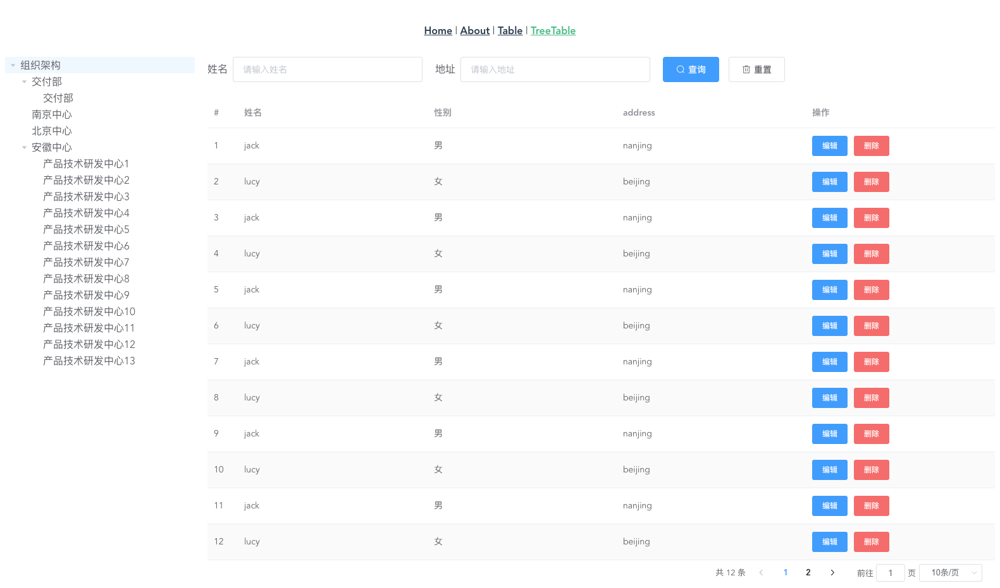

## TreeTablePagination 表格树组件


### TreeTablePagination Attributes
| 参数      | 说明          | 类型      | 可选值                           | 默认值  |
|---------- |-------------- |---------- |--------------------------------  |-------- |
| tree-props | tree参数配置 | object | — | — |
| table-props | Table参数配置 | object | — | — |
| result-template | 定义接口返回数据的key值 | object	 | — | { status: 'status', msg: 'msg', data: { name: 'result', children: { data: 'list', total: 'total' } } } |

### TreeTablePagination Methods
| 方法名 | 说明 | 参数 |
| ---- | ---- | ---- |
| reload | 重新加载表格数据 | — | — |

### TreeProps Attributes

| 参数      | 说明          | 类型      | 可选值                           | 默认值  |
|---------- |-------------- |---------- |--------------------------------  |-------- |
| url | tree 请求 url | string | — | — |
| method | tree 请求方式 | string | `post`/`get` | get |
| expandRootParent | 是否展开第一个节点| boolean | — | true |

**备注：** 其它属性请参考 [`Element UI Tree`](https://element.eleme.cn/#/zh-CN/component/tree) 组件  


### TableProps Attributes

**备注：** 属性请参考 [`Table`](../Table/README.md) 组件

### 使用方式同 [Table 组件](../Table/README.md)

### 举个🌰

```html
<template>
  <div>
    <tree-table-pagination
      ref="tabletree"
      :tree-props="treeprops"
      :table-props="tableProps"
    />
  </div>
</template>

<script>
export default {
  data () {
    return {
      treeprops: {
        url: '/api/tree',
        props: {
          children: 'children',
          label: 'label'
        },
        nodeKey: 'id',
        method: 'get',
        expandOnClickNode: false,
        expandRootParent: true,
        nodeExpand: (data, node, self) => {
          console.log(data, node, self)
        }
      },
      tableProps: {
        url: '/api/table',
        stripe: true,
        showOriginalOperator: true,
        border: false,
        onEdit: (params, event) => {
          event.stopPropagation()
          console.log('点击了编辑按钮', params, event)
        },
        onDelete: (params, event) => {
          console.log('点击了删除按钮', params, event)
          event.stopPropagation()
          this.$refs.tabletree.reload()
        },
        searchColumns: [
          {
            type: 'input',
            text: '姓名',
            prop: 'name'
          },
          {
            type: 'input',
            text: '地址',
            prop: 'address'
          }
        ],
        rowHeader: [
          {
            label: '#',
            type: 'index'
          },
          {
            label: '姓名',
            prop: 'name'
          },
          {
            label: '性别',
            prop: 'sex',
            render: (h, params) => {
              return h('div', params.row.sex === 0 ? '男' : '女')
            }
          },
          {
            label: 'address',
            prop: 'address'
          }
          // {
          //   label: '操作',
          //   render: (h, params) => {
          //     return (
          //       <div>
          //         <el-button type='primary' onClick={e => {
          //           console.log(e)
          //           e.stopPropagation()
          //           console.log(params)
          //         }}>编辑</el-button>
          //         <el-button type='danger' onClick={() => {
          //           console.log(params)
          //           this.$refs.tabletree.reload()
          //         }}>删除</el-button>
          //       </div>
          //     )
          //   }
          // }
        ]
      }
    }
  }
}
</script>

```

**截图**


